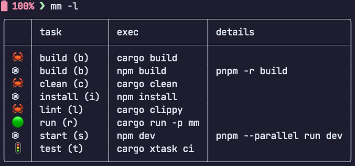

<h1 align="center">
   
   <br/>
   Devstart
</h1>

<h4 align="center"> Devstart: run dev tasks without thinking</h4>
<p align="center">

</p>
<p align="center">
  <a href="#how-to-use">How To Use</a> •
  <a href="#download">Download</a> •
  <a href="#contributing">Contributing</a> •
  <a href="#license">License</a>
</p>


## How to Use

`ds` will discover tasks from:

* `Cargo` (predefined)
* `node` (package.json)
* `make` (Makefile)
* Feel free to [submit a PR to add](https://github.com/jondot/devstart/pulls) your favorite one

Listing tasks from all package managers (currently showing Cargo) assigned as common tasks (build, test, clean, etc.):

```
$ ds -l
╭────┬───────────┬─────────────────┬─────────╮
│    │ task      │ exec            │ details │
├────┼───────────┼─────────────────┼─────────┤
│ 🦀 │ build (b) │ cargo build     │         │
│ 🦀 │ clean (c) │ cargo clean     │         │
│ 🦀 │ lint (l)  │ cargo clippy    │         │
│ 🟢 │ run (r)   │ cargo run -p ds │         │
│ 🚦 │ test (t)  │ cargo xtask ci  │         │
╰────┴───────────┴─────────────────┴─────────╯
```

You can use `-a` to show _all_ tasks, even those tasks which aren't common:

```
$ ds -l -a
< list of all discovered tasks >
```

Run a task using an _alias_ (`b` for `build`)

```
$ ds b
```

Or with a task name:

```
$ ds build
```

Or just `ds` to select a task to run:

```
$ ds
? Select task ›
❯ 🦀  [build] cargo build
  🦀  [clean] cargo clean
  🦀  [lint] cargo clippy
  🟢  [run] cargo run -p ds
  🚦  [test] cargo xtask ci
```

You can override and configure your own local tasks which will _overlay_ on top of the discovered tasks.


```
$ ds --init
wrote .devstart.yaml
```

Edit `.devstart.yaml`:

```yaml
tasks:
  run: 
    exec: cargo run -p ds
    emoji: 🟢

  test: 
    exec: cargo xtask ci
    emoji: 🚦
```


## Download

For macOS:

```
brew tap jondot/tap && brew install ds
```

Otherwise, grab a release from [releases](https://github.com/jondot/devstart/releases) and run `bp --help`:

# Contributing

We are accepting PRs. Feel free to [submit PRs](https://github.com/jondot/devstart/pulls).

To all [Contributors](https://github.com/jondot/devstart/graphs/contributors) - you make this happen, thanks!

# License

Copyright (c) 2023 [@jondot](http://twitter.com/jondot). See [LICENSE](LICENSE.txt) for further details.
